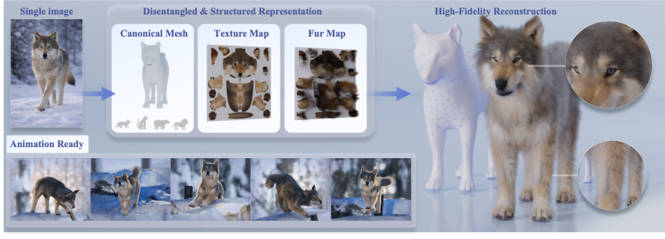

<div align="center">

# AnimalLift

**From a single image to an animal mesh, UV texture, and hair.**

Run inference in Python. Load the results in Blender. Save a portable `.blend` scene.

[Hugging Face Model](https://huggingface.co/Chunyi99/AnimalLift/tree/main) · [Hugging Face Dataset](https://huggingface.co/datasets/Chunyi99/AnimalLift)

<p>
  
</p>

[Quick Start](#quick-start) · [Downloads](#downloads) · [Environment](#tested-environment) · [Inference](#inference) · [Blender](#blender) · [Training](#training) · [Configuration](#configuration)

</div>

---

AnimalLift predicts geometry, appearance, and hair from an input image. Training and inference can run on a server, while Blender can load the exported results on the same machine or another computer.

- **Try the examples:** 16 input images are included for testing.
- **Process a folder:** export meshes, UV textures, hair maps, and a result manifest.
- **Save Blender scenes:** load one prediction at a time, with automatic `.blend` saving and packed textures.
- **Configure each machine:** set paths in JSON or override them on the command line.

## Quick Start

### 1. Install dependencies

Create a clean Python environment and install the pinned training/inference dependencies:

```bash
conda create -n animallift python=3.10.20 pip -y
conda activate animallift
python -m pip install -r requirements.txt
python -m pip check
```

`requirements.txt` installs **PyTorch 2.4.0 + CUDA 12.4** and **torchvision 0.19.0 + CUDA 12.4**, along with the packages used for model execution and pretrained weight loading. The installation targets **Linux x86_64 with an NVIDIA GPU**. Use a driver compatible with CUDA 12.4. The PyTorch wheels provide the CUDA runtime libraries used by the model; a separate CUDA compiler toolkit is not needed for the supplied training and inference code. See the [official PyTorch 2.4.0 installation options](https://pytorch.org/get-started/previous-versions/#v240).

For scene export, install **Blender 4.2**, the version used for testing, with its **Essentials procedural hair assets**. Run `load_blender.py` with Blender's own Python environment; `bpy`, `bmesh`, `mathutils`, and Blender's NumPy are supplied by Blender.

See [Tested Environment](#tested-environment) for package versions and [optional texture generation](#optional-texture-generation) for the separate Qwen setup.

### 2. Prepare the checkpoint and assets

Download the checkpoint from [Hugging Face](https://huggingface.co/Chunyi99/AnimalLift/tree/main) into `ckpt/`:

```bash
hf download Chunyi99/AnimalLift --local-dir ckpt
```

Inference expects `ckpt/latest.pt` by default. If the downloaded checkpoint has another filename or is inside a subdirectory, place the desired weight file at `ckpt/latest.pt` or set `test.resume` to its actual path.

Keep the auxiliary resources in `assets/`; see [Model and auxiliary assets](docs/ASSETS.md) for the expected files. The training dataset is not required to run inference.

> **Before the first run:** the checkpoint must be present. Initial model loading may also download the pretrained SD VAE and DINOv2 weights.

### 3. Run a first prediction

Run the following commands from the project root:

```bash
# Predict one of the included examples.
python test.py --max_images 1 --batch_size 1

# Load the prediction in Blender and save the scene without opening a window.
blender --background --python-exit-code 1 --python load_blender.py -- \
  --results_dir outputs/test
```

Predictions are written to `outputs/test/`. The Blender scene is saved automatically as:

```text
outputs/test/blender/<sample>.blend
```

The Blender command selects the first prediction in filename order. Use a fresh result folder or pass `--sample` to select a specific result. See [Blender](#blender) for interactive loading and export options.

## Downloads

The AnimalLift checkpoint and training dataset are hosted on **Hugging Face**.

| Resource | Download | Local location |
| --- | --- | --- |
| AnimalLift checkpoint | [Model repository](https://huggingface.co/Chunyi99/AnimalLift/tree/main) | `ckpt/` (default weight path: `ckpt/latest.pt`) |
| Training dataset | [Dataset repository](https://huggingface.co/datasets/Chunyi99/AnimalLift) | `data/Animal_Textures/` |
| Auxiliary assets | Included in the resource ZIP | `assets/` |
| 16 example images | Included | `input_images/` |

Use the checkpoint download command in [Quick Start](#quick-start). To select a differently named checkpoint, set `test.resume` or pass `--checkpoint` with the local file path. For a source-only checkout, extract the auxiliary bundle into `assets/`.

### Download the training dataset

Run this from the project root after installing `requirements.txt` (which includes the Hugging Face CLI):

```bash
hf download Chunyi99/AnimalLift \
  --repo-type dataset \
  --local-dir data/Animal_Textures
```

This destination matches the default `train.base_root`. It should contain the species directories directly, for example `data/Animal_Textures/dog/dataset/`. To store the dataset elsewhere, change `--local-dir` and set `train.base_root` to that directory in `config.local.json`.

The dataset is needed for training; checkpoint inference uses your input images and the auxiliary assets.

**Resource guides:** [Model and auxiliary assets](docs/ASSETS.md) · [Training data layout](docs/DATASET.md)

## Tested Environment

Training and inference were tested in a Linux environment with **Python 3.10.20** and **CUDA 12.4**. Blender scene loading and `.blend` export were tested with **Blender 4.2**.

| Component | Version | Used for |
| --- | --- | --- |
| Python | `3.10.20` | Training and inference runtime |
| PyTorch | `2.4.0+cu124` | Model execution and training |
| torchvision | `0.19.0+cu124` | Image transforms and output saving |
| NumPy | `2.2.6` | Mesh, UV, and hair-map arrays |
| Pillow | `12.3.0` | Input and texture image I/O |
| tqdm | `4.67.3` | Progress reporting |
| timm | `1.0.26` | DINOv2 backbone |
| Diffusers | `0.34.0` | Stable Diffusion `AutoencoderKL` |
| huggingface-hub | `1.27.0` | Pretrained downloads and `hf` CLI |
| safetensors | `0.8.0` | Pretrained weight serialization |
| Accelerate | `1.14.0` | Memory-efficient pretrained VAE loading |
| Blender | **`4.2`** | Hair visualization and `.blend` export |

The pinned requirements cover the training/inference entry points and their model-loading support. Pip also installs their transitive dependencies. Blender uses its bundled Python environment; the Python and NumPy versions above refer to training and inference.

<details>
<summary><strong>Check the Python environment</strong></summary>

Run from the project root after installation. This checks imports and reports versions without downloading model weights:

```bash
python -m pip check
python -c "import torch, torchvision; from diffusers import AutoencoderKL; import animallift.model; print('PyTorch:', torch.__version__); print('torchvision:', torchvision.__version__); print('CUDA runtime:', torch.version.cuda); print('CUDA available:', torch.cuda.is_available())"
blender --version
```

</details>

## Inference

### Use the included images

```bash
python test.py
```

By default, this processes all 16 images in `input_images/`, loads `ckpt/latest.pt`, and saves predictions in `outputs/test/`.

### Use your own image folder

```bash
python test.py \
  --input_dir my_images \
  --output_dir outputs/my_test \
  --batch_size 2
```

| Input requirement | Behavior |
| --- | --- |
| Formats | PNG, JPG, JPEG, WEBP, and BMP; uppercase extensions are supported |
| Folder layout | Images must be directly inside the folder; subfolders are not scanned |
| Filenames | Use unique stems, such as `cat_01` and `cat_02` |
| Transparency | Alpha is composited onto a white background |
| Resolution | Images are resized to the checkpoint's control resolution |

`--input_dir` is an alias for `--flat_val_image_dir`; `--checkpoint` is an alias for `--resume`. Reduce `--batch_size` if GPU memory is insufficient.

### Prediction outputs

For an input named `animal_2.png`, the result folder contains:

| Path relative to the result folder | Content |
| --- | --- |
| `meshes/animal_2_mesh.obj` | Predicted mesh with reference topology and UVs |
| `textures/animal_2_uv.png` | Predicted UV texture |
| `hair/animal_2_hair.npz` | Quantized hair offsets for Blender |
| `hair/animal_2_hair.png` | Hair preview |
| `input_images/animal_2.png` | Copy of the input image |
| `manifest.csv` | Relative paths to each sample's output files |

> **Use the matching reference OBJ.** Its vertex count, vertex order, face order, UV layout, and hair-anchor metadata must agree with the checkpoint's template. Matching vertex counts alone is not sufficient.

## Blender

**Tested with Blender 4.2.** Install its Essentials procedural hair assets before loading predictions.

### Open a prediction

```bash
blender --python load_blender.py -- \
  --results_dir outputs/test \
  --sample animal_2
```

`--results_dir` points to the folder containing `meshes/`, `textures/`, and `hair/`. `--sample` is the input filename without its extension. If omitted, the loader selects the first matching OBJ in filename order and prints its name.

**Each invocation loads one animal and automatically saves its scene.** Output directories are created as needed, and loaded images are packed by default.

| Default behavior | Setting |
| --- | --- |
| Save the scene | `blender.save_blend: true` |
| Choose the filename automatically | `blender.save_blend_path: null` |
| Output location | `<results_dir>/blender/<sample>.blend` |
| Pack loaded images | `blender.pack_assets: true` |
| HDRI lighting | Disabled; enable with `--use_hdri` |

### Run on a server

```bash
blender --background --python-exit-code 1 --python load_blender.py -- \
  --results_dir outputs/test \
  --sample animal_2
```

No display is required for background loading and saving. `--python-exit-code 1` returns a nonzero exit status if the loader fails, allowing server jobs to detect errors. Blender 4.2 and its procedural hair Essentials assets must be installed on the server.

### Move results between machines

Copy the **entire result folder**, keeping `meshes/`, `textures/`, and `hair/` together. Also make the project code and auxiliary assets available on the Blender machine. Set `blender.results_dir` in that machine's `config.local.json` to the copied folder.

<details>
<summary><strong>More Blender options: custom filename, explicit OBJ, UI, and lighting</strong></summary>

#### Set the output filename

```bash
blender --background --python-exit-code 1 --python load_blender.py -- \
  --sample animal_2 \
  --save_blend_path outputs/scenes/animal_2.blend
```

Repeated runs for the same sample write to the same destination. Use `--no-save_blend` to load without saving, or `--no-pack_assets` to keep external image references.

#### Load an explicit OBJ

```bash
blender --python load_blender.py -- \
  --obj_path outputs/test/meshes/animal_2_mesh.obj
```

When `--obj_path` is specified, the automatic save destination is derived from that OBJ's result folder.

#### Run from Blender's interface

1. Set `blender.results_dir` and `blender.sample` in `config.local.json`.
2. Open the **Scripting** workspace and load `load_blender.py` from disk in the Text Editor.
3. Choose **Run Script**.

Keep the script beside `config.json` and `animallift/`. Start with a fresh scene: the loader removes the default Cube and changes render settings. If the `blender` executable is not on `PATH`, use its full path in terminal commands.

#### Enable HDRI lighting

Set `blender.use_hdri` to `true` or pass `--use_hdri`. The configured HDR file must be available in `assets/` or at the path specified in your configuration.

The loader creates geometry, hair, and materials. It does not automatically position a camera or render an image.

</details>

## Training

Download the [AnimalLift dataset](https://huggingface.co/datasets/Chunyi99/AnimalLift) using the [dataset download instructions](#download-the-training-dataset). The default download directory matches `train.base_root`; see the [training data layout](docs/DATASET.md) for sample structure and set the shared resource paths as needed.

```bash
# Train using all six configured species.
python train.py

# Train using selected species.
python train.py --animals dog wolf --batch_size 8

# Train from a single dataset root.
python train.py --no-all_animals --data_root data/Animal_Textures/dog/dataset

# Resume a training run.
python train.py --resume outputs/train/multitask/checkpoints/latest.pt
```

Checkpoints are saved under `outputs/train/multitask/checkpoints/`. Use `python test.py --checkpoint <checkpoint_path>` to select one for inference.

The included example images can be used for qualitative validation. Training requires the full paired dataset.

### Optional texture generation

<details>
<summary><strong>Separate environment for Qwen UV texture generation</strong></summary>

`dataset_generation/gen_dog_dataset.py` generates edited dog UV textures from `assets/base_texture.png`, using the Qwen model specified by `dataset_generation.model_id`.

This utility produces textures only. Rendered controls, meshes, hair maps, and annotations must be provided separately for a complete training dataset.

This utility uses `QwenImageEditPlusPipeline` and is outside the pinned training/inference environment. Set up a separate environment following the [Qwen-Image-Edit-2511 installation instructions](https://huggingface.co/Qwen/Qwen-Image-Edit-2511#quick-start), including a Diffusers version that exposes this pipeline and its Transformers dependencies. The base `diffusers==0.34.0` pin is for AnimalLift's SD VAE; it is not a Qwen installation target.

Before running the utility, verify the pipeline in that separate environment:

```bash
python -c "from diffusers import QwenImageEditPlusPipeline; print('Qwen pipeline available')"
```


</details>

## Configuration

Default paths are defined in `config.json`. For each machine, create a `config.local.json` containing only the settings you want to override; it is ignored by Git.

```json
{
  "train": {
    "base_root": "data/Animal_Textures"
  },
  "blender": {
    "results_dir": "outputs/my_test",
    "sample": "animal_2"
  }
}
```

**Precedence:** command-line options → selected override file → `config.json`.

| Path or option | How it works |
| --- | --- |
| Relative paths | Resolved from the project root, including command-line paths |
| Absolute paths | Used directly |
| `~` and `${ENV_VAR}` | Expanded before use; referenced variables must be defined |
| `null` | Leaves an optional path unset |
| Windows paths | Forward slashes can be used in JSON |
| No `--config` | Automatically loads `config.local.json` if present |
| Explicit `--config` | Loads that file over the defaults; does not also load `config.local.json` |

Select a configuration file explicitly:

```bash
python test.py --config config.server.local.json

blender --python load_blender.py -- --config config.desktop.local.json
```

<details>
<summary><strong>Pretrained models and offline VAE loading</strong></summary>

The frozen SD VAE is loaded separately from the AnimalLift checkpoint. Its default model is `stabilityai/sd-vae-ft-mse`; the checkpoint records the actual VAE identity and architecture. The DINOv2 backbone is initialized through timm as `vit_small_patch14_dinov2.lvd142m`.

For a local VAE installation:

```json
{
  "shared": {
    "vae_local_path": "assets/sd_vae",
    "vae_local_files_only": true
  }
}
```

The directory must contain a Diffusers VAE configuration and the **same pretrained weights** used with the checkpoint. If the checkpoint specifies `vae_subfolder`, preserve that subfolder inside the local directory. The local path changes the loading location while retaining the checkpoint's VAE metadata checks.

DINO/timm weights must also be cached before an offline run. `vae_local_files_only` controls VAE loading only; it does not disable DINO downloads.

</details>

<details>
<summary><strong>Checkpoint compatibility</strong></summary>

The supported checkpoint is the SD-VAE multitask format, containing `args`, `vae_config`, `model`, `template_verts`, `num_verts`, `hair_channels`, and `hair_size`, with optional `ema_model` weights. Old custom-AE checkpoints are incompatible.

</details>

## Project Layout

| Path | Purpose |
| --- | --- |
| `train.py` | Training entry point; also supports `infer_multitask` |
| `test.py` | Folder inference entry point |
| `load_blender.py` | Blender loading and automatic scene saving |
| `animallift/` | Shared model, inference, and configuration code |
| `requirements.txt` | Pinned training/inference dependencies |
| `config.json` | Default paths and runtime settings |
| `config.local.json` | Optional configuration for the current machine |
| `ckpt/` | AnimalLift checkpoints |
| `assets/` | Auxiliary resources |
| `input_images/` | 16 example input images |
| `dataset_generation/` | Optional UV texture generation |
| `outputs/` | Predictions, training checkpoints, and Blender scenes |

## Checks

```bash
python train.py --help
python test.py --help
python -m unittest discover -s tests -v
python -m compileall -q .
```
